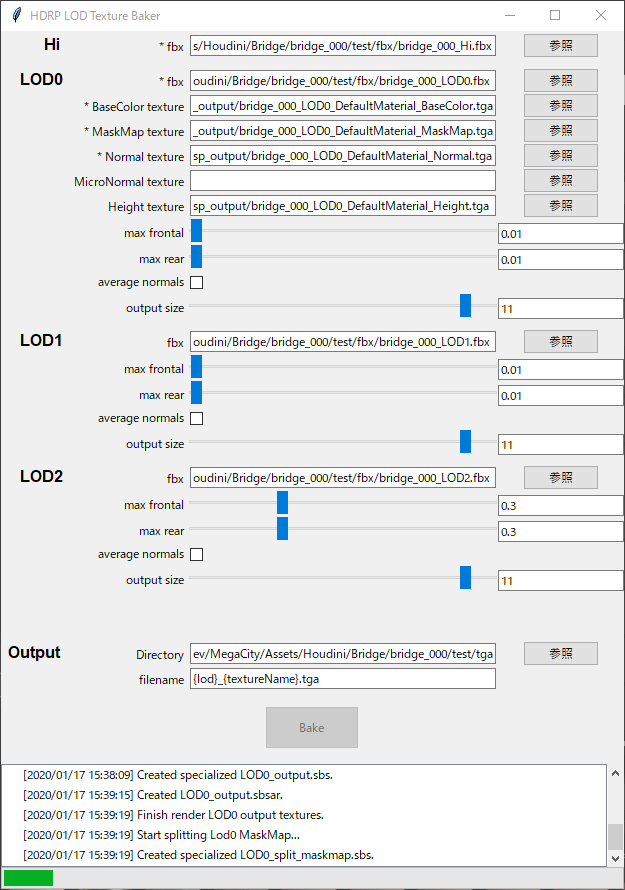

# HDRP-LOD-Texture-Baker

This is a tool to transfer LOD0 texture to LOD1 and LOD2 using Substance Automation Toolkit.

blog: [Substance Automation Toolkitを利用してHDRP向けLOD0テクスチャをLOD1、LOD2に転写するツールを作成した | 測度ゼロの抹茶チョコ](https://matcha-choco010.net/2020/01/17/hdrp-lod-texture-baker/)
